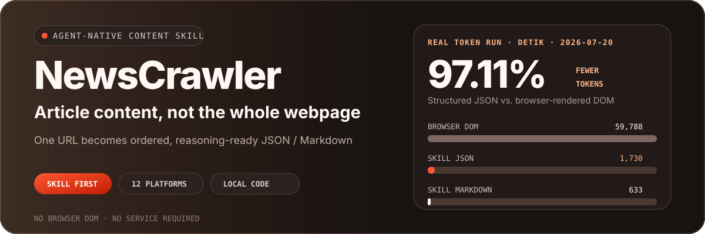
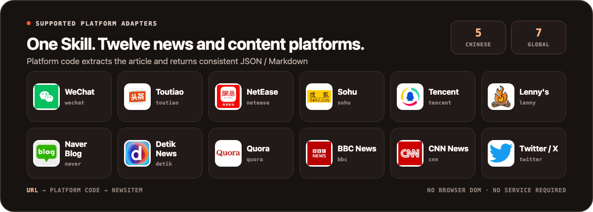
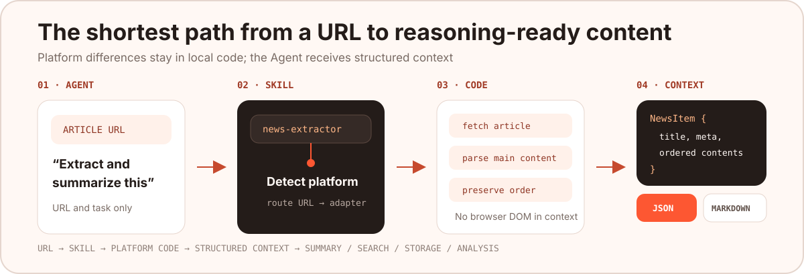

<p align="center">
  
</p>

<p align="center">
  <a href="https://github.com/NanmiCoder/NewsCrawler/stargazers"></a>
  <a href="./.claude/skills/news-extractor/SKILL.md"></a>
  <a href="https://github.com/vercel-labs/skills"></a>
  
  <a href="https://www.python.org/downloads/"></a>
  <a href="./LICENSE"></a>
</p>

<p align="center">
  <strong>Give an Agent one URL and get the article, images, and metadata—without launching a browser or filling context with the entire DOM.</strong>
  <br>
  English · <a href="./README.md">简体中文</a>
</p>

NewsCrawler's primary product is the portable **`news-extractor` Agent Skill**. It packages extraction code for 12 news and content platforms in one self-contained directory, so Codex, Claude Code, and other Agents that support `SKILL.md` can extract articles locally and receive consistent JSON or Markdown.

## 12 supported platforms

<p align="center">
  
</p>

<details>
<summary><strong>View URL recognition examples</strong></summary>

| ID | Example URL pattern |
| --- | --- |
| `wechat` | `mp.weixin.qq.com/s/...` |
| `toutiao` | `toutiao.com/article/...` |
| `netease` | `163.com/news/article/...` |
| `sohu` | `sohu.com/a/...` |
| `tencent` | `news.qq.com/rain/a/...` |
| `lenny` | `lennysnewsletter.com/...` |
| `naver` | `*.naver.com/...` |
| `detik` | `news.detik.com/...` |
| `quora` | `*.quora.com/...` |
| `bbc` | `bbc.com/news/articles/...` |
| `cnn` | `cnn.com/YYYY/MM/DD/...` |
| `twitter` | `x.com/<user>/status/<id>` |

</details>

> Site structures, login flows, and anti-bot rules change. If extraction fails, first verify the URL pattern, network access, and cookie requirements, then inspect the relevant adapter.

## Why Agents need this Skill

When you give a general-purpose Agent only a link, it still has to decide how to open the page, where the article starts, which menus and recommendations are noise, and how images relate to the text.

| Generic browser path | NewsCrawler Skill path |
| --- | --- |
| URL → launch browser → load DOM / accessibility tree → find article → remove noise → reason | URL → detect platform → extract with code → normalize as `NewsItem` → reason |
| Context may contain scripts, navigation, ads, recommendations, and duplicate links | Context contains only the title, metadata, ordered article content, and media |
| The Agent must rediscover each site's structure | Platform rules live in testable, reusable adapters |
| Requires a browser session and several tool calls | Runs as a local command with no persistent service |

The main saving is not just extraction time. It preserves expensive model context for summarization, retrieval, comparison, and judgment.

## Real-world test: how many tokens does one article save?

On 2026-07-20, we tested the same live [Detik News article](https://news.detik.com/berita/d-8562773/gunung-anak-krakatau-erupsi-muntahkan-abu-vulkanik-150-meter) through both paths. The Skill successfully extracted **10 text blocks and 1 image**.

Every payload was counted with the same `tiktoken o200k_base` tokenizer:

| Content sent to the Agent | Tokens | Compared with full DOM |
| --- | ---: | ---: |
| Browser-rendered DOM | 59,788 | Baseline |
| Browser accessibility snapshot | 6,842 | 88.56% fewer |
| Browser visible text | 1,907 | 96.81% fewer |
| **Skill structured JSON** | **1,730** | **97.11% fewer** |
| **Skill Markdown** | **633** | **98.94% fewer** |

> Structured JSON reduced the payload from 59,788 tokens to 1,730—about **1/34.56** the size of the browser DOM. When the Agent only needs to read the article, Markdown uses 633 tokens, or about **1/94.45**.

The result has important boundaries:

- Compared with browser `body.innerText`, JSON used 9.28% fewer tokens and Markdown used 66.81% fewer. The Skill also provides clean sections and stable fields instead of only shortening text.
- Compared with an already compressed browser accessibility snapshot, JSON still used 74.71% fewer tokens and Markdown used 90.75% fewer.
- This is one live page measured at one point in time; other sites will produce different ratios.
- The numbers cover content payloads only. They exclude prompts, tool-call wrappers, screenshots, and model output.
- Browser compression strategies, accessibility trees, and tokenizers differ across Agents and will change the absolute counts.

The complete counts, hashes, and reproduction notes are stored in the [benchmark record](./benchmarks/token-efficiency/2026-07-20-detik.json). The original webpage and article content are not copied into this repository.

<details>
<summary><strong>View the test method</strong></summary>

The browser side loaded the article in the same signed-out session and captured:

```text
document.documentElement.outerHTML  → rendered DOM
agent-browser snapshot -c          → accessibility snapshot
agent-browser get text body        → visible text
```

The Skill side ran:

```bash
cd .claude/skills/news-extractor
uv sync
uv run scripts/extract_news.py \
  "https://news.detik.com/berita/d-8562773/gunung-anak-krakatau-erupsi-muntahkan-abu-vulkanik-150-meter" \
  --format both
```

Finally, `tiktoken.get_encoding("o200k_base")` counted the DOM, accessibility snapshot, visible text, JSON, and Markdown payloads.

</details>

## Installation: two Agent-friendly options

`news-extractor` follows the open [Agent Skills specification](https://agentskills.io/specification). [vercel-labs/skills](https://github.com/vercel-labs/skills) can discover and install it directly from this repository. The source directory is [`.claude/skills/news-extractor`](./.claude/skills/news-extractor/), which contains the complete `SKILL.md`, scripts, dependencies, and references.

### Option 1: use `npx skills` (recommended)

No repository clone or manual directory copy is required:

```bash
npx skills add NanmiCoder/NewsCrawler --skill news-extractor -g
```

The command detects supported Agents on your machine and lets you choose the installation target. You can also specify one directly:

```bash
# Codex
npx skills add NanmiCoder/NewsCrawler --skill news-extractor -g -a codex -y

# Claude Code
npx skills add NanmiCoder/NewsCrawler --skill news-extractor -g -a claude-code -y
```

`npx skills` installs the Skill files. On first use, the Agent follows `SKILL.md` and runs `uv sync` inside the Skill directory to install the Python dependencies.

### Option 2: send this README to your Agent

If you do not want to run the command yourself, send this entire prompt to Codex, Claude Code, or another Skills-compatible Agent:

```text
Read this project's README:
https://github.com/NanmiCoder/NewsCrawler/blob/main/README.en.md

Follow the Agent Skills installation instructions in the README and install the
news-extractor Skill for yourself. After installation, run --list-platforms to
verify it. Do not start Docker, MCP, or the Web UI.
```

The Agent can get the standard installation command from the README, then follow the repository's `SKILL.md` for dependencies and usage.

### First invocation

After installation, give the Agent a link and a task:

```text
Use the news-extractor Skill to extract and summarize this article:
https://news.detik.com/berita/d-8562773/gunung-anak-krakatau-erupsi-muntahkan-abu-vulkanik-150-meter
```

The Agent detects the task from the Skill description and runs the appropriate local script. You do not need to start the Web UI, FastAPI, MCP, or Docker.

For a manual check, run this inside the Skill directory:

```bash
uv run scripts/extract_news.py "URL" --format json --output ./output
```

See the [Skill documentation](./.claude/skills/news-extractor/SKILL.md) for more options and examples.

## What the Agent receives

Every platform is normalized into the same `NewsItem` shape:

```json
{
  "title": "Article title",
  "news_url": "https://example.com/article",
  "news_id": "article-id",
  "meta_info": {
    "author_name": "Author",
    "author_url": "https://example.com/author",
    "publish_time": "2026-01-01 10:00:00"
  },
  "contents": [
    {"type": "text", "content": "First paragraph", "desc": ""},
    {"type": "image", "content": "https://example.com/image.jpg", "desc": ""},
    {"type": "video", "content": "https://example.com/video.mp4", "desc": ""}
  ],
  "texts": ["First paragraph"],
  "images": ["https://example.com/image.jpg"],
  "videos": ["https://example.com/video.mp4"]
}
```

- `contents` preserves the original order of text, images, and video.
- `texts`, `images`, and `videos` give Agents and downstream programs direct access to a specific content type.
- Markdown is convenient for reading, summarization, and knowledge bases; JSON is better for search, storage, analysis, and workflow orchestration.

## How the Skill works

<p align="center">
  
</p>

1. The Agent identifies an article-extraction task from the `SKILL.md` description.
2. `detector.py` selects a platform from the URL.
3. The matching crawler fetches the page, and platform-specific code locates the article and media.
4. `NewsItem` normalizes the fields while preserving content order.
5. The Agent reads only JSON or Markdown and uses the remaining context for summarization, retrieval, or analysis.

```text
news-extractor/
├── SKILL.md
├── pyproject.toml
├── references/
│   └── platform-patterns.md
└── scripts/
    ├── extract_news.py
    ├── detector.py
    ├── formatter.py
    ├── models.py
    └── crawlers/              # independent implementations for 12 platforms
```

## Development and extension

```bash
# Root repository dependencies and tests
uv sync
uv run pytest

# Validate the Skill
cd .claude/skills/news-extractor
uv sync
uv run scripts/extract_news.py --list-platforms
```

When adding a platform, update all three layers:

1. The crawler and URL detection rules inside the Skill.
2. The service adapter under the root repository's `news_extractor_core/adapters/`.
3. Parser tests, sanitized fixtures, and the README platform list.

Issues and pull requests are welcome. Include a reproducible URL, expected fields, and sanitized actual output. Never submit cookies, tokens, or site credentials.

## Responsible use and license

- This repository is intended for learning, research, and personal content workflows. You are responsible for verifying that your use case is lawful.
- Follow the target site's terms of service, `robots.txt`, copyright requirements, and applicable laws.
- Keep request rates reasonable and avoid unnecessary load on target sites.
- Pass cookies for authenticated content through local configuration; never commit them to source control.
- Site changes can break adapters. Please report failures with reproducible, sanitized examples.

The code is released under the [GNU General Public License v3.0](./LICENSE); the exact rights and obligations are defined by the license text. Copyright and usage rights for extracted content remain with the original sites and rights holders.

## Other interfaces (lower priority)

The Skill is the recommended entry point. Use the following modes only when you need a shared service, an HTTP API, or a manual interface.

<details>
<summary><strong>Use the Python package directly</strong></summary>

```python
from news_extractor_core.services import ExtractorService, to_markdown

news, platform = ExtractorService.extract_news("URL")
print(news.to_dict())
print(to_markdown(news))
```

</details>

<details>
<summary><strong>MCP / FastAPI / Web UI / Docker Compose</strong></summary>

MCP is useful when extraction must be shared as an Agent service. FastAPI and the Web UI are intended for system integration or manual operation. None of them is required to use the Skill.

```bash
docker compose up -d
```

| Service | Address |
| --- | --- |
| Web UI | [http://localhost:3021](http://localhost:3021) |
| FastAPI | [http://localhost:8000/docs](http://localhost:8000/docs) |
| MCP | `http://localhost:8765/mcp` |

See the [Docker deployment guide](./DOCKER_DEPLOYMENT.md) and [MCP documentation](./news_extractor_mcp/README.md) for full setup details.

</details>

<p align="center">
  If NewsCrawler helps your Agent spend context on reasoning instead of webpage noise, consider giving the project a Star.
</p>
