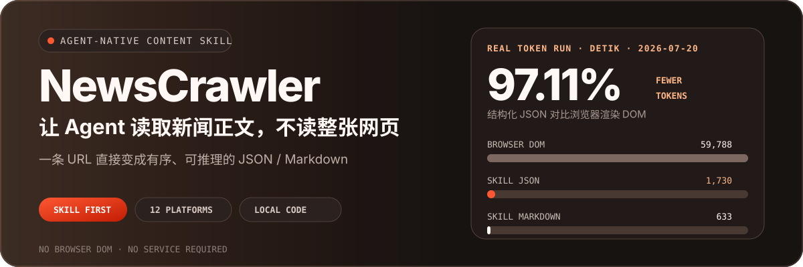
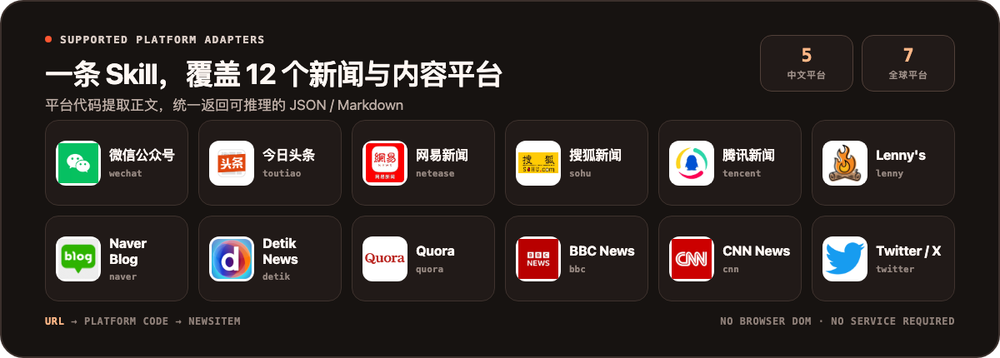
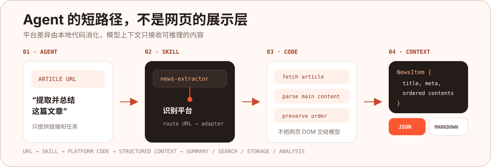

<p align="center">
  
</p>

<p align="center">
  <a href="https://github.com/NanmiCoder/NewsCrawler/stargazers"></a>
  <a href="./.claude/skills/news-extractor/SKILL.md"></a>
  <a href="https://github.com/vercel-labs/skills"></a>
  
  <a href="https://www.python.org/downloads/"></a>
  <a href="./LICENSE"></a>
</p>

<p align="center">
  <strong>给 Agent 一条 URL，直接拿到正文、图片和元数据；不启动浏览器，不把整页 DOM 塞进上下文。</strong>
  <br>
  <a href="./README.en.md">English</a> · 简体中文
</p>

NewsCrawler 的首要产品是可迁移的 **`news-extractor` Agent Skill**。它把 12 个新闻与内容平台的抓取代码打包在一个自包含目录中，让 Codex、Claude Code 或其他支持 `SKILL.md` 的 Agent 在本地直接提取文章，返回统一 JSON 或 Markdown。

## 支持的 12 个平台

<p align="center">
  
</p>

<details>
<summary><strong>查看 URL 识别示例</strong></summary>

| ID | URL 识别示例 |
| --- | --- |
| `wechat` | `mp.weixin.qq.com/s/...` |
| `toutiao` | `toutiao.com/article/...` |
| `netease` | `163.com/news/article/...` |
| `sohu` | `sohu.com/a/...` |
| `tencent` | `news.qq.com/rain/a/...` |
| `lenny` | `lennysnewsletter.com/...` |
| `naver` | `*.naver.com/...` |
| `detik` | `news.detik.com/...` |
| `quora` | `*.quora.com/...` |
| `bbc` | `bbc.com/news/articles/...` |
| `cnn` | `cnn.com/YYYY/MM/DD/...` |
| `twitter` | `x.com/<user>/status/<id>` |

</details>

> 网站结构、登录策略和反爬规则会变化。遇到失败时，先确认 URL 形态、网络访问和 Cookie 要求，再检查对应 Adapter。

## 为什么 Agent 需要这个 Skill

只把链接交给通用 Agent 时，它通常还要自己解决“如何打开网页、哪一块才是正文、菜单和推荐要不要保留、图片顺序是什么”等问题。

| 普通浏览器路径 | NewsCrawler Skill 路径 |
| --- | --- |
| URL → 打开浏览器 → 加载 DOM / 无障碍树 → 识别正文 → 清理噪声 → 推理 | URL → 匹配平台 → 代码提取正文 → 统一 `NewsItem` → 推理 |
| 上下文可能包含脚本、导航、广告、推荐与重复链接 | 上下文只包含标题、元数据、有序正文和媒体 |
| Agent 每次都要重新理解站点结构 | 平台规则由 Adapter 维护，可测试、可复用 |
| 需要浏览器会话与多轮工具调用 | 本地命令执行，不需要常驻服务 |

它节省的不只是抓取时间，更重要的是把昂贵的模型上下文留给总结、检索、比较和判断。

## 真实测试：一篇文章省了多少 Token

2026-07-20，我们用同一篇真实的 [Detik News 文章](https://news.detik.com/berita/d-8562773/gunung-anak-krakatau-erupsi-muntahkan-abu-vulkanik-150-meter) 做了对照。Skill 成功提取 **10 段正文和 1 张图片**。

所有文本都使用同一个 `tiktoken o200k_base` 编码器计数：

| 输入给 Agent 的内容 | Token | 对比完整 DOM |
| --- | ---: | ---: |
| 浏览器渲染 DOM | 59,788 | 基线 |
| 浏览器无障碍快照 | 6,842 | 少 88.56% |
| 浏览器可见文本 | 1,907 | 少 96.81% |
| **Skill 结构化 JSON** | **1,730** | **少 97.11%** |
| **Skill Markdown** | **633** | **少 98.94%** |

> 结构化 JSON 从 59,788 tokens 降到 1,730 tokens，体积约为浏览器 DOM 的 **1/34.56**。如果 Agent 只需要阅读正文，Markdown 只要 633 tokens，约为 **1/94.45**。

这个结果也有边界：

- 对比浏览器 `body.innerText` 时，JSON 少 9.28%，Markdown 少 66.81%；Skill 的额外价值是正文已经分段、去除页面噪声并带有稳定字段，而不只是字符更少。
- 对比已经压缩过的浏览器无障碍快照，JSON 仍少 74.71%，Markdown 少 90.75%。
- 这是一个动态页面在单一时间点的实测，不代表所有站点都会得到相同比例。
- 数字只统计实际内容载荷，不包含提示词、工具调用封装、截图和模型输出。
- 不同 Agent 的浏览器压缩策略、无障碍树和 tokenizer 会改变绝对数字。

完整计数、哈希和复现口径保存在 [基准记录](./benchmarks/token-efficiency/2026-07-20-detik.json)；原网页与文章内容没有复制进仓库。

<details>
<summary><strong>展开查看测试方法</strong></summary>

浏览器侧使用同一无登录会话加载文章，并分别取得：

```text
document.documentElement.outerHTML  → 渲染 DOM
agent-browser snapshot -c          → 无障碍快照
agent-browser get text body        → 可见文本
```

Skill 侧执行：

```bash
cd .claude/skills/news-extractor
uv sync
uv run scripts/extract_news.py \
  "https://news.detik.com/berita/d-8562773/gunung-anak-krakatau-erupsi-muntahkan-abu-vulkanik-150-meter" \
  --format both
```

最后用 `tiktoken.get_encoding("o200k_base")` 分别统计 DOM、无障碍快照、可见文本、JSON 和 Markdown。

</details>

## 安装：两种方式交给 Agent

`news-extractor` 遵循开放的 [Agent Skills 规范](https://agentskills.io/specification)，可以被 [vercel-labs/skills](https://github.com/vercel-labs/skills) 从仓库中自动发现和安装。Skill 的源目录是 [`.claude/skills/news-extractor`](./.claude/skills/news-extractor/)，其中包含完整的 `SKILL.md`、脚本、依赖和参考资料。

### 方式一：使用 `npx skills`（推荐）

不需要先克隆仓库，也不需要手工复制目录：

```bash
npx skills add NanmiCoder/NewsCrawler --skill news-extractor -g
```

命令会检测本机支持的 Agent，并让你选择安装目标。也可以明确指定：

```bash
# Codex
npx skills add NanmiCoder/NewsCrawler --skill news-extractor -g -a codex -y

# Claude Code
npx skills add NanmiCoder/NewsCrawler --skill news-extractor -g -a claude-code -y
```

`npx skills` 负责安装 Skill 文件；首次执行时，Agent 会按照 `SKILL.md` 在 Skill 目录运行 `uv sync`，安装 Python 依赖。

### 方式二：把 README 链接发给 Agent

如果你不想自己执行命令，把下面整段内容直接交给 Codex、Claude Code 或其他支持 Skills 的 Agent：

```text
请阅读这个项目的 README：
https://github.com/NanmiCoder/NewsCrawler/blob/main/README.md

按照 README 中的 Agent Skills 安装方式，为你自己安装 news-extractor Skill。
安装后运行 --list-platforms 验证，不要启动 Docker、MCP 或 Web UI。
```

Agent 会从 README 获得标准安装命令，并从仓库中的 `SKILL.md` 读取后续依赖与使用说明。

### 第一次调用

安装后，直接在 Agent 对话里给链接和任务：

```text
使用 news-extractor Skill 提取并总结这篇文章：
https://news.detik.com/berita/d-8562773/gunung-anak-krakatau-erupsi-muntahkan-abu-vulkanik-150-meter
```

Agent 会根据 Skill 描述自动识别任务，并在本地执行对应脚本。无需启动 Web UI、FastAPI、MCP 或 Docker。

需要手动验证时，可以在 Skill 目录运行：

```bash
uv run scripts/extract_news.py "URL" --format json --output ./output
```

更多参数和示例见 [Skill 使用说明](./.claude/skills/news-extractor/SKILL.md)。

## Agent 会拿到什么

所有平台都归一化为同一个 `NewsItem`：

```json
{
  "title": "文章标题",
  "news_url": "https://example.com/article",
  "news_id": "article-id",
  "meta_info": {
    "author_name": "作者",
    "author_url": "https://example.com/author",
    "publish_time": "2026-01-01 10:00:00"
  },
  "contents": [
    {"type": "text", "content": "第一段正文", "desc": ""},
    {"type": "image", "content": "https://example.com/image.jpg", "desc": ""},
    {"type": "video", "content": "https://example.com/video.mp4", "desc": ""}
  ],
  "texts": ["第一段正文"],
  "images": ["https://example.com/image.jpg"],
  "videos": ["https://example.com/video.mp4"]
}
```

- `contents` 保留文本、图片和视频在原文中的顺序。
- `texts`、`images`、`videos` 方便 Agent 或下游程序直接访问特定类型。
- Markdown 适合阅读、总结和知识库写入；JSON 适合检索、入库、分析和工作流编排。

## Skill 是怎样工作的

<p align="center">
  
</p>

1. Agent 根据 `SKILL.md` 的描述识别新闻提取任务。
2. `detector.py` 根据 URL 选择平台。
3. 对应 Crawler 获取页面，并由平台代码定位正文和媒体。
4. `NewsItem` 统一字段并保留内容顺序。
5. Agent 只读取 JSON 或 Markdown，用剩余上下文完成总结、检索或分析。

```text
news-extractor/
├── SKILL.md
├── pyproject.toml
├── references/
│   └── platform-patterns.md
└── scripts/
    ├── extract_news.py
    ├── detector.py
    ├── formatter.py
    ├── models.py
    └── crawlers/              # 12 个平台的独立实现
```

## 开发与扩展

```bash
# 根仓库依赖与测试
uv sync
uv run pytest

# 验证 Skill
cd .claude/skills/news-extractor
uv sync
uv run scripts/extract_news.py --list-platforms
```

新增平台时，请同时维护：

1. Skill 内对应的 Crawler 与 URL 检测规则。
2. 根仓库 `news_extractor_core/adapters/` 的服务化 Adapter。
3. 解析测试、脱敏样例和 README 平台表。

欢迎提交 [Issue](https://github.com/NanmiCoder/NewsCrawler/issues) 或 Pull Request。请附上可复现 URL、预期字段和脱敏后的实际输出；不要提交 Cookie、Token 或站点凭据。

## 使用边界与许可证

- 仓库面向学习、研究与个人内容工作流；请自行确认具体使用场景的合法性。
- 遵守目标网站的服务条款、robots.txt、版权要求和适用法律。
- 控制抓取频率，不要对目标站点造成额外负担。
- 需要登录的内容应通过本地配置传入 Cookie，切勿提交到版本库。
- 页面结构变化可能导致适配器失效，欢迎用可复现样例报告问题。

代码以 [GNU General Public License v3.0](./LICENSE) 发布；许可权利与义务以 `LICENSE` 原文为准。被提取内容的版权和使用权限仍归原站点及内容权利人所有。

## 其他接入方式（低优先级）

Skill 是推荐入口。只有在需要共享服务、HTTP 接口或人工界面时，才需要下面这些模式。

<details>
<summary><strong>直接使用 Python 包</strong></summary>

```python
from news_extractor_core.services import ExtractorService, to_markdown

news, platform = ExtractorService.extract_news("URL")
print(news.to_dict())
print(to_markdown(news))
```

</details>

<details>
<summary><strong>MCP / FastAPI / Web UI / Docker Compose</strong></summary>

MCP 适合把提取能力作为共享 Agent 服务；FastAPI 和 Web UI 适合系统集成或人工操作。它们都不是使用 Skill 的前置条件。

```bash
docker compose up -d
```

| 服务 | 地址 |
| --- | --- |
| Web UI | [http://localhost:3021](http://localhost:3021) |
| FastAPI | [http://localhost:8000/docs](http://localhost:8000/docs) |
| MCP | `http://localhost:8765/mcp` |

完整说明见 [Docker 部署文档](./DOCKER_DEPLOYMENT.md) 和 [MCP 文档](./news_extractor_mcp/README.zh-CN.md)。

</details>

<p align="center">
  如果 NewsCrawler 帮你的 Agent 把上下文留给真正的推理，欢迎点一个 Star。
</p>
